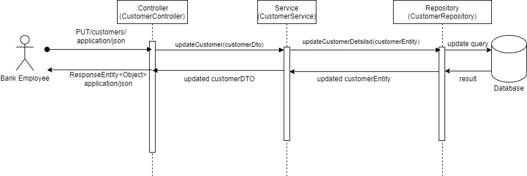

# Backend Architecture Details

---

## Table of Contents

- [Class Diagram](#class-diagram)
  - [Bank Implementation](#bank-implementation)
  - [Business Users Implementation](#business-users-implementation)
    + [Enums](#enums)
  - [Business Service Implementation](#business-service-implementation)
- [Object Diagram](#object-diagram)
- [Component Diagram](#component-diagram)
- [Use case Diagrams](#use-case-diagrams)
- [Sequence Diagrams](#sequence-diagrams)

---

### Class Diagram

#### Bank Implementation
The bank model works the same as with real world banks.
So far, the bank has two types of money:
- physical
- virtual

Whenever the bank takes physical money from the customer, it extracts that
amount of money from the bank's account and transfers it to the customer's 
account.

#### Business Implementation
In the first meeting, we discussed how the system should work, and the types of users 
that will use the system.

The team decided to divide the system users into two types:

- `Customer` - person who uses the system.
- `Employee` - person who operates the system.

And there are two types of employees:
- `Admin`
- `Manager`

We defined them by using a `UserRoles` model.

#### Enums
To put a boundary on models, we used several Enumerations.

#### Business Service Implementation
In our second meeting, we discussed how the system service will be implemented.
1. Each `Customer` can have only one `Account` for payments and transfers 
   (initially we were unsure whether we would implement a joint account feature).
2. Each service works with `Transaction` in order to provide traceability of money, 
   and to record all transfers that occurred on the account. 

---

### Object Diagram
The object diagram is drawn with the help of our class diagram and other diagrams. 
By doing so, I ensured that the logic of our object diagram coincides with that of the 
class diagram and with the actual project code.

---

### Component Diagram

To showcase the implementation layer of the system, component diagrams, use case diagrams 
and sequence diagrams are shown below:

---

### Use case Diagrams
From our user stories ([all user stories](user-stories.md)), we developed the logic of 
our system by constructing Use Case Diagrams as a team. We decided each user story will 
have one use case diagram to make the implementation process easier, and to make it easy 
to grasp the logic of our application.

#### Account Logic
The first aspect of the system we defined was the Account framework.

1) We created the logic where a bank employee creates an account on behalf of the customer.
   
2) We developed the scenario where a bank employee edits a customer's account details.
   
3) We developed the scenario where the customer edits their own account details.
   
4) We developed the scenario where the customer closes his or her account.
   

---

#### Transaction Logic
1) Use case diagram for Deposit logic
   
2) Use case diagram for Withdrawal logic
   
3) Use case diagram for Transfer logic
   
4) Use case diagram for Mobile Bank Transfers
   
5) Use case diagram for changing the Transfer amount
   

6) Customer deposits money to the bank
   
7) Customer cancels a transaction

   

8) Admin sees the transaction logs
   

---

### Sequence Diagrams

1) As a bank employee, I want to create an account on behalf of the customer.
   

2) As a bank employee, I want to modify the customer's account details.
   

   

3) As a customer, I want to modify my account details via online banking.

   

4) As a bank employee, I want to close a customer's account.

   

5) As a bank employee, I want to deposit money into a customer's account.

   

6) As a bank employee, I want to withdraw money from a customer's account at their request.

   

7) As a customer, I want to transfer money in a bank branch.

   

8) As a customer, I want to transfer money via mobile banking.

   

9) As a bank employee, I want to modify a transaction so that I can handle transaction requests.

   

10) As a Bank Employee, I want to cancel a customer’s transaction on his or her behalf.

11) As a bank admin, I want to see the transaction logs so that I can know by whom and when the transaction modification request is processed.

